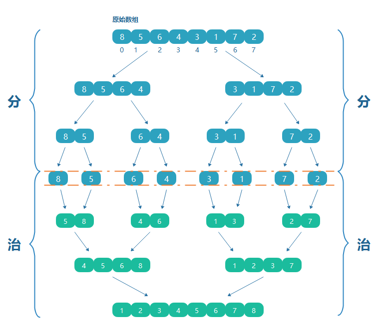
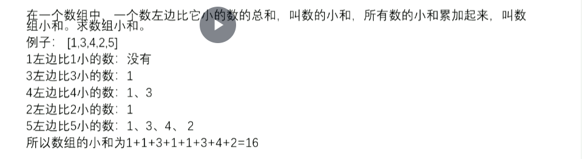

# algorithm

## 1.异或

- 两个数异或相当于2进制位无进制相加

- 0^N == N   N^N == 0

- 异或运算满足交换律和结合律

- 提取一个不为0的数的最右侧的1

  ~~~c#
  a = a & ((~a) +1); 
  ~~~

## 2.排序算法

### 1.归并

### 2.理解归并排序

- 小和问题

  

反过来理解:一个数右边比它大的数的和的累加

1 : 4次

3 : 2次

4 : 1次

2 : 1次

5 : 0 次

**比较的时机: 归并排序在merge 的时候比较左右2组数大小时候**

## 3.堆结构

- 完全二叉树
- 大根堆
- 小根堆
- Heapify 方法: 在堆结构上,arr[index]位置的数，能否往下移动
- 优先级队列(小根堆)

## 4.比较器

- 规定2个样本怎么比较大小
- 

