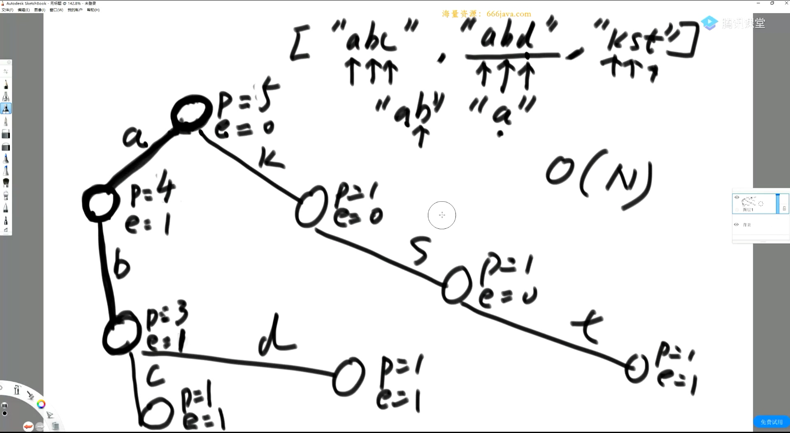
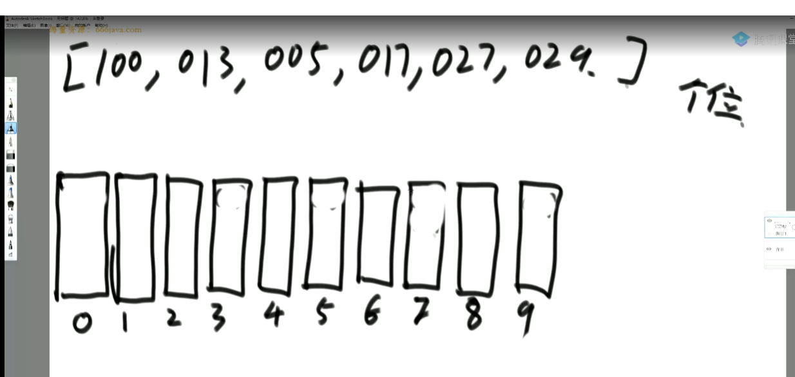
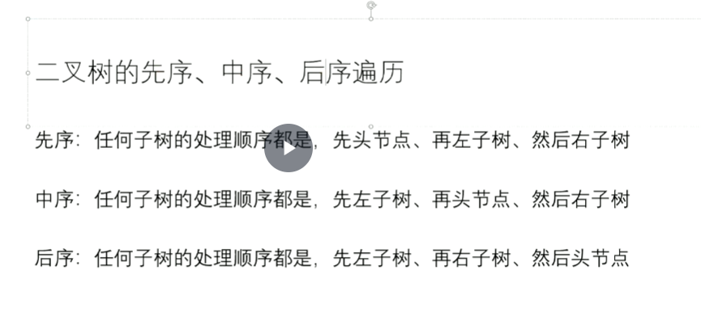
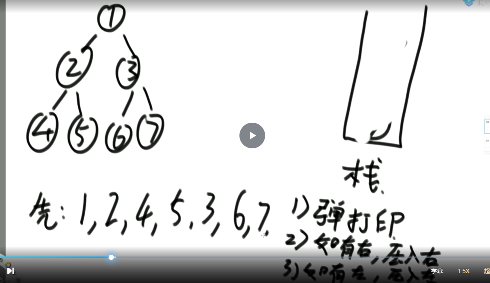
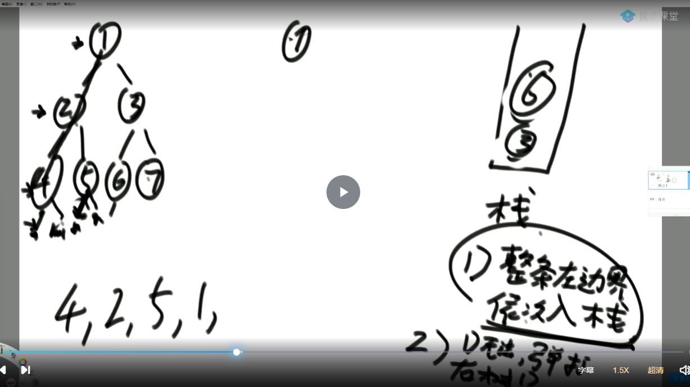
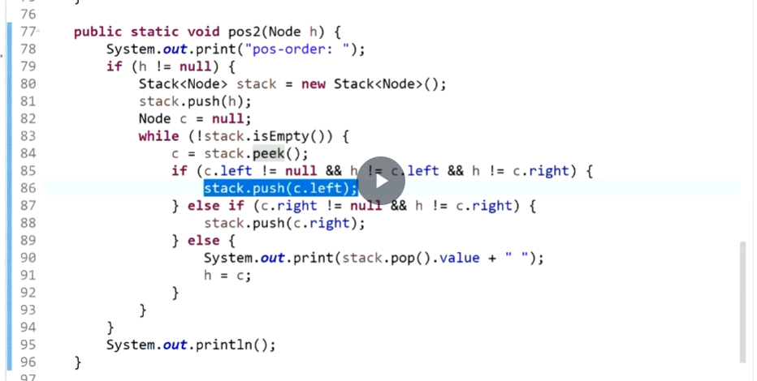

# algorithm

## 1.异或

- 两个数异或相当于2进制位无进制相加

- 0^N == N   N^N == 0

- 异或运算满足交换律和结合律

- 提取一个不为0的数的最右侧的1

  ~~~c#
  a = a & ((~a) +1); 
  ~~~

## 2.排序算法

### 1.归并

### 2.理解归并排序

- 小和问题

  

反过来理解:一个数右边比它大的数的和的累加

1 : 4次

3 : 2次

4 : 1次

2 : 1次

5 : 0 次

**比较的时机: 归并排序在merge 的时候比较左右2组数大小时候**

## 3.堆结构

- 完全二叉树
- 大根堆
- 小根堆
- Heapify 方法: 在堆结构上,arr[index]位置的数，能否往下移动
- 优先级队列(小根堆)

## 4.比较器

- 规定2个样本怎么比较大小

## 5.前缀树

## 6.计数排序

一个位一个位(个位,十位,百位,千位.....)放在桶里面排序,再取出

## 7.二叉树

### 1.先序,中序,后序

### 2.子树

从某一个头节点出发,全部拿出当前节点及其子节点

### 3.非递归方式实现二叉树的先序,中序,后序遍历

#### 1).任何递归函数都可以改成非递归

#### 2).自己设计压栈实现

- 非递归方式实现先序

  

- 非递归方式实现后序

  和先序相反的顺序压入一个栈,再取出

- 非递归方式实现中序

  

- 一个栈实现后序遍历

### 4.二叉树的按层遍历

